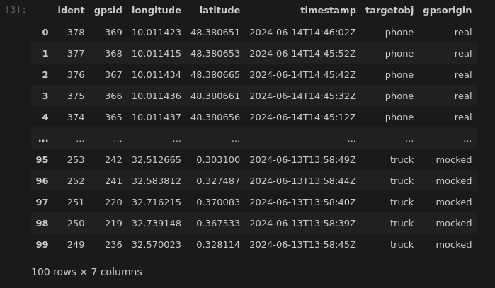

# Introduction and Targets
This Hackathon took place between June 10 to 14 at the Neu-Ulm University of Applied Science in Germany. For one week, 17 dedicated students from three different countries came together to work on solutions to urgent problems in Uganda's fisheries. The participants formed four mixed teams of four to five students each from Neu-Ulm University of Applied Sciences, the University of Western Cape in South Africa and the Uganda Management Institute. The idea of this Hackathon came through the visits of the lecturers and professors of the project team from Neu-Ulm University of Applied Sciences (HNU), the University of the Western Cape (UWC) and the Uganda Management University (UMI) to Uganda in May 2024. 

This file is used as a documentation and shows the results of the Hackathon.

Document about Fish-Transportation in Uganda: [link](./doc/Fish%20Transportation%20in%20Uganda.pdf)  
End Presentation: [link](.???)  

Link to Miro-Board: https://miro.com/app/board/uXjVMTfASQ4=/  

## Tasks

Link to user stories: [User stories](//github.com/HNU-UWC-UMI/2024_SmartNilePerchRepo/issues)

## Stakeholder

| Role         | Contact        | Expectations      |
|--------------|----------------|-------------------|
| Product Owner| dany.meyer@hnu.de | The need for wireless technologies and tracking systems (architecture) makes a business sense in terms of cold chain management of the container for safety of fish and remote tracking for security of fish. I expect a system as a prototype with which I can demonstrate a digital solution that monitors and evaluates the temperature and position of a box. I would like to experience the creation of the prototype within a week by an agile team.|
| DAAD and BMZ | *<Kontakt-2>* | strengthen university partnerships, create opportunities for home university students and internatial students to work together and experience intercultural contacts  |
| Uganda fisherie | *\<Kontakt-2>* | a smart and more efficient solution of transporting fish from victoria lake in Uganda to EU  |

## Sub-Projects / Team

| Sub-Project/Modul      | Team            | Names + Responsibility                                                                                                                                                |  
|------------------------|-----------------|-----------------------------------------------------------------------------------------------------------------------------------------------------------------------|
| *\<Example Modul>*     | Team A          | Micky Mouse (py-Code), Donald Duck (doc), Gustav Gans (test)                                                                                                          |
| Apex-DB                | Team 4          | *\<Name1, Name2, Name3, Moritz.Gruber (DBAdministration, RESTful-Provider)>*                                                                                          |
| Apex-Forms             | Team 4          | *\<Name1, Name2, Name3, Name4>*                                                                                                                                       |
| IoT-Counter            | Team 3          | *Alexander Schobloch (py-Code, doc), Julia Hosch (py-Code, test, doc), Yusuf Gitta (Requirements, Presentation), Nomonde Bridgette Zama (Requirements, Presentation)* |
| IoT-Temperature        | Team 2          | *Jenny Gia-Linh Huynh (py-code, grafana, Apex-DB), Isabell Riffel(github documentation), Siyabonga Luvuno Jele(py-code, grafana)=, Isaac Senda(presentation slides)*  |
| Grafana                | Team 2          | *Siyabonga Luvuno Jele, Jenny Gia-Linh Huynh, Name3, Name4>*                                                                                                          |
| GPS-Flutter-App        | Team 1          | *Athi Yonela Mngqundaniso, Nicolai Gerster*                                                                                                                           |
| GPS-Map / Mocking-Data | Team 1          | *Jan Schneider, Nicolai Gerster*                                                                                                                                      |
| Box Prototyp           | Team 2 / Team 3 | *Alexander Schobloch, Julia Hosch, Jenny Gia-Linh Huynh, Siyabonga Jele*                                                                                              |

# Systemarchitecture
Picture  
*\<Link a picture>*  

Modules  
*\<Short Description e.g.>*
1. The Module Apex-Backend is used to store data, provide REST interfaces and dialogs for data input and reporting
2. The Module IoT-Counter is used ..
3. The Module IoT-Temp is used ..
4. The Module GPS-App is used ..
5. ...

Interfaces  
*\<Short Description of interfaces>*

## Module Apex-Backend: DB-Model

* *\<Target/Requirement>*The main target was the storage of the data gathered by each group according to their requirements. As well as providing RESTful-Services in order to allow the according data input and offer the option to "GET" the stored data packages for visualization purposes. 
* *\<Interfaces: links to GET + POST + examples of JSON>*

| Links to Get & Post     | Topic         | JSON-Examples    |
|------------------------|-----------------|-----------------|
| https://apex.oracle.com/pls/apex/hackathonjune2024/NilePProject/TEMPERATURE_DATA | *Temperature* | *{"tempId": 2, "temp": -2.3, "inRange": 0, "timeStamps": "2024-06-12 09:43:32"}* |
| *https://apex.oracle.com/pls/apex/hackathonjune2024/NilePProject/FISHCOUNTER_DATA* | *FishCounter* | *{"fishCounterId":22, "containerId": 22, "fishCounterSize": 6000}* |
| *https://apex.oracle.com/pls/apex/hackathonjune2024/NilePProject/FISHDESC_DATA* | *FishDescription* | *{"fishID": 1, "fishWeight": "3000g", "fishSize": "large", "LocalExport": "O 1" }* |
| *https://apex.oracle.com/pls/apex/hackathonjune2024/NilePProject/GpsData* | *GPS* | *{"gpsId": 1,"longi":84.37608,"lati":-26.29409,"TimeStamp":"2024-06-12 09:43:32","targetOBJ":"BOAT","gpsOrigin":"real"}* |
| *https://apex.oracle.com/pls/apex/hackathonjune2024/NilePProject/INSPECTORREPORT_DATA* | *InspectorForm* | ** |

* *\<Concepts: ER-Diagramm>*


* *\<Artifacts: link to ddl>*

| DDL    | Topic         | TABLE   |
|------------------------|-----------------|-----------------|
| ** | ** |
| ** | ** |
| ** | ** |
| ** | **  |
| *CREATE TABLE "INSPECTOR_REPORT" 
   (	"INSPECTION_ID" NUMBER(8,0) GENERATED BY DEFAULT ON NULL AS IDENTITY MINVALUE 1 MAXVALUE 9999999999999999999999999999 INCREMENT BY 1 START WITH 1 CACHE 20 NOORDER  NOCYCLE  NOKEEP  NOSCALE  NOT NULL ENABLE, 
	"FISH_TYPE" VARCHAR2(64 CHAR), 
	"FISH_SIZE" VARCHAR2(16 CHAR), 
	"QUALITY" VARCHAR2(16 CHAR), 
	"QUANTITY" NUMBER(6,0), 
	"FIRST_NAME" VARCHAR2(32), 
	"LAST_NAME" VARCHAR2(32), 
	"INSPECTION_DATE" DATE, 
	 CONSTRAINT "INSPECTOR_REPORT_PK" PRIMARY KEY ("INSPECTION_ID")
  USING INDEX  ENABLE
   ) ;* | ** |

* *\<Artifacts: screenShots of Apex-Forms>*
* *\<Access to Apex: link / workspace / user / pwd >* LINK: https://apex.oracle.com/pls/apex/f?p=4550:1:4236082934922::::: / WORKSPACE: hackathonjune2024 / USER: MORITZ.GRUBER_1@STUDENT.HNU.DE / PWD: D81mwdH-18


## Module IoT-Counter+Temp (both Teams together)
* *\<Target/Requirement>* Monitoring the temperature of the box of fish, so they don`t spoil. Counting the amount of fish, so the landing site knows how many trucks they then need to transport the fish. For this Use case we need a mobile power source and an internet connection is assumed.
* *\<Interfaces: links to POST>* [Line 70](./raspberry/Counter.py) ,  [Line 23](./raspberry/creating_db_fish_size.py) ,  [Line 53](./raspberry/Temp.py)
* *\<Concepts: Description of Logic + used Hardware>* We used a raspberry pi as our base computer. For the temperature we used an DHT22 Sensor.
For the Counting of the Fish we used an infrared sensor to see if a fish is being put into the box.
Adding to that we installed a button so when they take the fish out the counting process will be stopped, by pressing said button.
Another feature we added was an LED panel to indicate if the counter is running at the moment. If its green it is running, and if not its red. It will blink yellow if it's over the limit. We put the limit to 10 for presentation purposes.
Add the start the counting mechanism is off, and can be turned oon by pressing the button.
We connected the temperature sensor to the GPIO 4 Pin, the infrared sensor to the GPIO 23 , the button to GPIO 17 Pin, for the LED we used 27 for red, 22 for green, and 25 for yellow.
* *\<Artifacts: links to py-Code>* [Counter](./raspberry/Counter.py),   [DB_Creation](./raspberry/creating_db_fish_size.py),   [Temp](./raspberry/Temp.py)
* *\<Artifacts: fotos of Box>* [Complete Box](./images/SmartContainer_Box.jpeg), [Building the box](./images/Box_Prototype/IMGP2165.JPG), [Building the box](./images/Box_Prototype/IMGP2156.JPG), [filling the box with fishes](./images/Box_Prototype/IMGP2196.JPG)

## Module GPS
* *Target/Requirement:* Tracking the boats, trucks, and the product (fish) to ensure that it stays in the supply chain, is on the right track and all participants are complying with laws. That can be harmed by fishing in forbidden zones.
* *Interfaces:* Link to GET's ([Line 8](tracking/map/map.py)) + POST ([Line 67](tracking/mock_data.py), [Line 93](tracking/flutter_files/flutter_lib/main.dart)) + examples of JSON (for mocking data and gps data from the flutter-app):
```
{"longi": 10.009358339673302, 
"lati": 48.38061466653206, 
"TimeStamp": 2024-06-27 19:50:00, 
"targetOBJ": "truck", 
"gpsOrigin": "real"}
* ```
* *Concepts:* 
  * *Flutter-App:* Because the Raspberry Pi did not work with the gps-sensor correctly, we have created a flutter-app to get the coordinates of a mobile phone. These coordinates were gathered with a button ("Start Tracking") from the built-in gps-sensor of the phone and were afterward pushed into the database as a post-request. By pressing the button ("Stop Tracking"), the flutter app and data traffic is paused until it is started again.
    * We have written a [README](tracking/flutter_files/README.md) file for the setup of this flutter project. The flutter files can be found [here](tracking/flutter_files).
  * *Map*: It's python code that works in conjunction with the folium library. Folium is a python implementation of the leaflet javascript package. Folium uses the OpenStreetMap as a base, and you can add things like lines and markes to it with arbitrary coordinates (latitude and longitude).
* *Artifacts:* Link to [Flutter-Project / files](tracking/flutter_files)
* *Artifacts:* Link to [mock_data.py](./tracking/mock_data.py). It takes coordinates and a target object (boat, truck, plane, phone) to first call an API for routing on land and for a direct connection between the destinations of boats and planes. After the points were created, they are posted into the database.
* *Artifacts:* link to a working [jupyter notebook](./tracking/map/geo_map.ipynb). It also contains much information on what how code works. It also includes examples and extras not implemented in the python file mentioned below.
* *Artifacts:* link to a working [map.py](./tracking/map/map.py)
* *Artifacts:* link to a working [map.html](./tracking/map/map.html). Downloading and opening this html file shows what you can expect from the python code.

* *Artifacts:* Screenshot of DB Request to use with plotting things on the map 
 
## Module Grafana
* *\<Target/Requirement>* Displaying temperature and fish counter in real-time on a dashboard
* *\<Interfaces: links to GET>* [Fish counter](//apex.oracle.com/pls/apex/hackathonjune2024/NilePProject/FISHCOUNTER_DATA?/orders/${orderId}), [Temperature](//apex.oracle.com/pls/apex/hackathonjune2024/NilePProject/TEMPERATURE_DATA?/orders/${orderId}) 
* *\<Concepts: which Platform>* We used Grafana to visualize real time data of fish counter, temperature and if the temperature is in the supposed to be range. We display the datas on different dashboards and used different panels like bar chart and graphs. Each panel can be customized with different visualization options, query settings, and display styles. With queries we retrieved the datas from different data sources like temperature from the DHT22 Sensor or fish counter from the infrared sensor. With threshold, we are able to display an alert message, if the temperature is not within the supposed to be range, e.g. if the temperature is above 0° C, the dashboard will show the temperature in red color, if its below 0°C, it will show in green color.
* *\<Artifacts: screenShots Grafana>* [Counter](./images/Dashboard/Img_fish_counter.png), [Temperature Series](./images/Dashboard/Img_Temperature_Series.png), [Temperature Table](./images/Dashboard/Img_Temperature_Table.png), [Temperature Table](./images/Dashboard/Img_Temperature_in_Range.png)


# Links from the Database
| Link         |        |
|--------------|----------------|
| *https://apex.oracle.com/pls/apex/hackathonjune2024/NilePProject/TEMPERATURE_DATA* | *temp* | 
| *https://apex.oracle.com/pls/apex/hackathonjune2024/NilePProject/FISHCOUNTER_DATA* | *counter* | 
| *https://apex.oracle.com/pls/apex/hackathonjune2024/NilePProject/FISHDESC_DATA* | *description* | 
| *https://apex.oracle.com/pls/apex/hackathonjune2024/NilePProject/GpsData* | *gps* | 
| *https://apex.oracle.com/pls/apex/hackathonjune2024/NilePProject/INSPECTORREPORT_DATA* | *inspector-form* | 
| *https://jelesiya.grafana.net/public-dashboards/8d5dca2de95240ccaba8c462f746f3d4* | *Dashboard temperature* |
| *https://jelesiya.grafana.net/public-dashboards/778e57ee95d64530a92b68a6f1f6f9c2* | *Dashboard fishcounter* |


# Planning

| Group         | Mon                                                                                                  | Tue                                                                                                                                                                                                                                                                               | Wed                                                                           | Thu                                                                                                                                                       | Fri                                                                                                                                         |
|---------------|------------------------------------------------------------------------------------------------------|-----------------------------------------------------------------------------------------------------------------------------------------------------------------------------------------------------------------------------------------------------------------------------------|-------------------------------------------------------------------------------|-----------------------------------------------------------------------------------------------------------------------------------------------------------|---------------------------------------------------------------------------------------------------------------------------------------------|
| 1             | Week planning                                                                                        | Setting up devices, Creating mocking data, DB architecture                                                                                                                                                                                                                        | Creating map, Further create mocking data                                     | Getting sensor data from device, Settling on API for DB to map, Connecting to  DB                                                                         | Implementing real sensor data on map, Last minute fixes, Presentation                                                                       |
| 2             | Week planning, Issues                                                                                | Data Base, work with Raspberry Pie                                                                                                                                                                                                                                                | Connecting with the other Groups, Integration, Testing, Dokumentation, Grafan | Grafana, Data base, work with group 3                                                                                                                     | Presentation                                                                                                                                |
| 3             | General planning/identifting/defining tools to use/understanding the integration of the the use case | looking at the raspeberry and the different sensors to use that will be applicable for counting and measuring the fish/created a simulation environment to use the scale to define weight of the fish. The simualation code worked but we change the plan to use a infared sensor | Integrating count system with temperature system                              | Database implemention and connection                                                                                                                      | Building the system and presentation                                                                                                        |
| 4             | General Planning procedures / increment for group and the whole project                              | Prepraring a Prototyp for the UI using MIRO / Deciding on a DBMS + First Considerations about InfluxDB / Firebase and finally Oracle Apex + Establishing first ER & ERR_Models                                                                                                    | Getting started on Oracle Apex / Table Creation / REST-API                    | Integrating the other Groups in the DB / Refining Processes / Integrating the general Form for the Insepctor / Creation of UI-Interface using Oracle Apex | Final Refinements before the Presentation (Integration of the optimized Inspector_Report + Preparation Process for the Final_Presentation   |


*\<Problems/Risks>*
