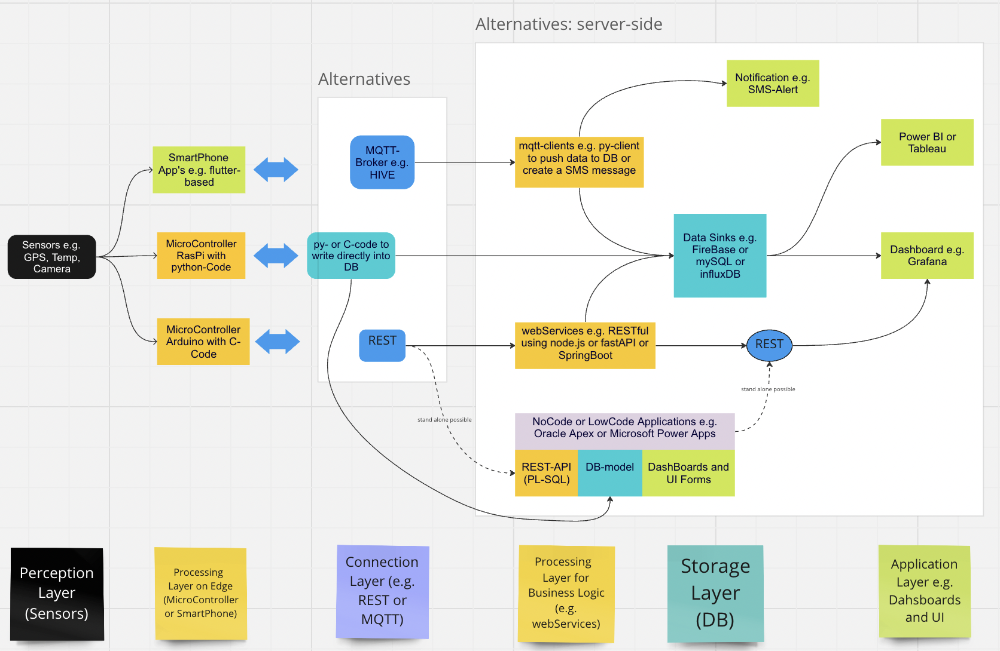

# Short Introduction into Technologies

 
 *Figure 1: Possible IoT-Architecture*

## Frontend Mobile: Getting Started with Flutter
A few resources to get you started if this is your first Flutter project:
- [Lab: Write your first Flutter app](https://docs.flutter.dev/get-started/codelab)
- [Cookbook: Useful Flutter samples](https://docs.flutter.dev/cookbook)
For help getting started with Flutter development, view the
[online documentation](https://docs.flutter.dev/), which offers tutorials,
samples, guidance on mobile development, and a full API reference.

## First Steps to create your Backend with Oracle Apex
Orcale Apex is a framework to design and hosting a database, create web-based-Apps on that database configering UI-Forms and enable easy to use RESTful interfaces to your database.
- [Getting Started with Oracle Apex](https://apex.oracle.com/en/learn/build-your-first-app/)
- [UWC and HNU video casts] (will you find in our moodle)
## Backend with InfluxDB and Grafana
## Introduction into IoT using RaspPi and Arduino
Here you will find some tutorials to programming Microcontroller to read sensors, control actors and connect to an infrastructure like RESTful webService:
- [RaspPi: Getting Started with RaspPi](https://www.raspberrypi.com/documentation/computers/getting-started.html)
- [Arduino: Getting Started with Arduino](https://www.arduino.cc)

We will support:
- RaspPi 4.0
- Arduino MKR WiFi 1010
- Arduino NodeMCU ESP8266 ESP-12FWiFi

### Sensors and Actors
- [RGB LED Modul](https://amzn.eu/d/d6ITTgt)
- [Temperature, Humidity, Air-Pressure] DHT11, DHT22
- [Moisture Sensor](https://learn.littlebirdelectronics.com.au/guides/use-a-moisture-sensor-with-arduino)
- [Distance Sensors: ultraSonic, infraRed](https://learn.littlebirdelectronics.com.au/guides/ultrasonic-rangefinder-with-arduino)
- [Volatile Organic Compound Sensor] SEN-CCS811
- [Servo Motor-Arduino Example](https://learn.littlebirdelectronics.com.au/guides/control-a-servo-with-arduino)
- [Relais and Water Pump-Arduino Example](https://learn.littlebirdelectronics.com.au/guides/automatic-plant-watering-with-arduino)
- [GPS Modul-Arduino Example](https://randomnerdtutorials.com/guide-to-neo-6m-gps-module-with-arduino/)
  
## Machine Learning and Jetson Nano
- [Google Colab as AI-Platform](https://colab.research.google.com/)
- [Getting Started with Jetson Nano](https://developer.nvidia.com/)

