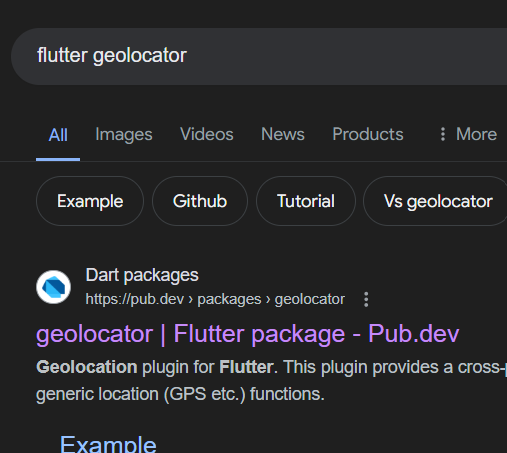

# hackathontracking

A new Flutter project.

## Getting Started

This project is a starting point for a Flutter application.

A few resources to get you started if this is your first Flutter project:

- [Lab: Write your first Flutter app](https://docs.flutter.dev/get-started/codelab)
- [Cookbook: Useful Flutter samples](https://docs.flutter.dev/cookbook)

For help getting started with Flutter development, view the
[online documentation](https://docs.flutter.dev/), which offers tutorials,
samples, guidance on mobile development, and a full API reference.

## Setup guide
1. Install android studio and flutter (android language --> java)
2. In flutter add dart
3. After setting up the project get to pubspec.yaml
4. Under dependencies add following (with the newest versions of the packages)
   ```
   flutter:
      sdk: flutter
      geolocator: ^12.0.0
      permission_handler: ^11.3.1
      http: ^1.2.1
      intl: ^0.19.0
   ```

   Here are some snippets:
   
   
   
   
6. Do a `pub get` in the terminal or ide to install the packages
7. Now, navigate to the Android Manifest in the `android/app/src/main` path
8. Alter the AndroidManifest.xml in there and put the following:
   between the application tag and the manifest tag add:
   
   `<uses-permission android:name="android.permission.ACCESS_FINE_LOCATION" />`
   
   `<uses-permission android:name="android.permission.ACCESS_COARSE_LOCATION" />`
   
   `<uses-permission android:name="android.permission.INTERNET" />`
   
   In the first metadata tag add the api key which can be acquired from google console:
   [https://console.cloud.google.com/google/maps-apis/]
10. For the same setup like in our project, use the provided main.dart file from the flutter_lib folder and replace your main.dart in your lib folder with it
11. Make sure that the android-sdk and emulator is installed
12. Configure your phone setup to be able to load the flutter app
13. Run the flutter app.
